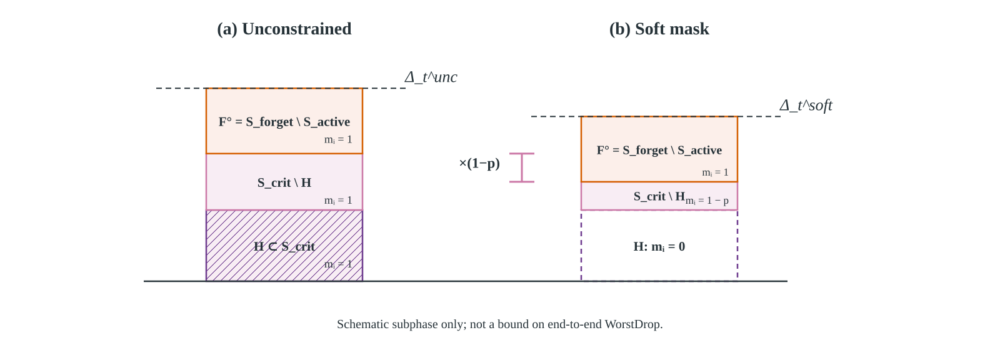
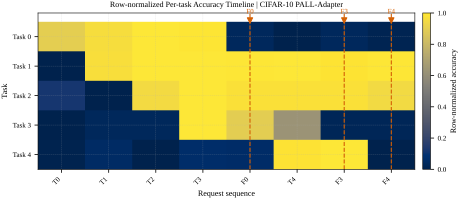

<!-- _class: title -->
<!-- _paginate: false -->
<!-- _footer: '' -->

# مدیریت فراموشی در یادگیری پیوسته با کمک روش‌های یادگیری ژرف

## محافظت آگاه از هم‌پوشانی برای فراموشی انتخابی

**فاطمه رائیجیان**
استاد راهنما: دکتر حمید بیگی

دانشکده مهندسی کامپیوتر · دانشگاه صنعتی شریف
شهریور ۱۴۰۵

<!--
شروع پیشنهادی: این پایان‌نامه درباره‌ی حذف یک وظیفه از مدل یادگیری پیوسته است؛ به‌گونه‌ای که اثر رفتاری آن سرکوب شود اما دانش وظایف باقی‌مانده کمترین آسیب را ببیند.
-->

---

# نقشه‌ی راه ارائه

  
<b>1</b> مسئله و پرسش پژوهشچرا حذف در مدل مشترک آسیب جانبی دارد؟

  
<b>2</b> پیشینه و شکافجداسازی کامل یا ویرایش مدل مشترک؟

  
<b>3</b> روش پیشنهادیEPALL و محافظت حساس به هم‌پوشانی

  
<b>4</b> ارزیابی تجربیمقایسه، آمار جفتی، هم‌پوشانی و هزینه

  
<b>5</b> ممیزی سازوکارنتیجه‌ی منفی PALL-Adapter

  
<b>6</b> جمع‌بندیمحدودیت‌ها و مسیر ادامه

<!--
نقشه‌ی راه را سریع مرور کنید. تاکید کنید که بخش چهارم هسته‌ی دفاع است و بخش پنجم یک ممیزی صادقانه از مسیر اکتشافی است.
-->

---

<!-- header: مقدمه و بیان مسئله -->
<!-- _class: s1 -->

# مسئله از یک درخواست واقعی آغاز می‌شود

پس از یادگیری چند وظیفه، باید <strong>یک وظیفه‌ی مشخص</strong> حذف شود؛ بدون بازآموزی از ابتدا و بدون تخریب وظایف فعال.

واحد حذف در این پایان‌نامه یک وظیفه‌ی کامل در سناریوی Task-Incremental است.

<!--
مرز مسئله را روشن کنید: شناسه‌ی وظیفه در استنتاج در دسترس است و درخواست حذف در سطح وظیفه تعریف می‌شود، نه رکورد یا کلاس.
-->

---

<!-- _class: s1 -->

# موفقیت فقط با دو شرط هم‌زمان تعریف می‌شود

  

    <h2>سرکوب هدف</h2>
    
دقت وظیفه‌ی حذف‌شده باید به سطح تصادفی نزدیک شود.

  

  

    <h2>نگه‌داری دانش</h2>
    
دقت وظایف فعال نباید پس از درخواست حذف افت محسوسی کند.

  

  
<b>Au ↓</b>دقت وظیفه‌ی حذف‌شده

  
<b>Afinal ↑</b>دقت نهایی وظایف فعال

  
<b>WorstDrop ↓</b>بدترین آسیب جانبی

یک روش می‌تواند افت نگه‌داری کمی داشته باشد، فقط چون اصلاً وظیفه‌ی هدف را فراموش نکرده است.

<!--
این نکته را برای تفسیر نتایج نگه دارید: معیار حذف و معیار نگه‌داری باید کنار هم خوانده شوند.
-->

---

<!-- _class: s1 -->

# منشأ آسیب جانبی، اشتراک پارامترهاست

  

    
  

  

    <h2>ناحیه‌ی انحصاری</h2>
    
بازنشانی آن معمولا خطر کمتری برای سایر وظایف دارد.

    <h2>ناحیه‌ی مشترک</h2>
    
هم هدف و هم وظایف فعال به آن وابسته‌اند.

    
اما همه‌ی مختصه‌های مشترک به یک اندازه حساس نیستند.

  

<!--
فرض مرکزی پایان‌نامه را بیان کنید: آسیب نه فقط در ناحیه‌ی مشترک، بلکه روی زیرمجموعه‌ای حساس از آن متمرکز است.
-->

---

<!-- _class: s1 compact -->

# شکاف پژوهش به چهار پرسش تبدیل شد

  
<b>RQ1</b>آیا حفاظت حساس، سرکوب و نگه‌داری را هم‌زمان ممکن می‌کند؟

  
<b>RQ2</b>مدل مشترک تا چه حد به جداسازی کامل نزدیک می‌شود؟

  
<b>RQ3</b>آیا با افزایش هم‌پوشانی، سود حفاظت رشد می‌کند؟

  
<b>RQ4</b>کدام مؤلفه واقعا منشأ بهبود مشاهده‌شده است؟

  
<b>هزینه</b>دقت بهتر با چه حافظه و زمان درخواستی به‌دست می‌آید؟

  
<b>دامنه‌ی ادعا</b>چه چیزی حذف رفتاری است و چه چیزی هنوز اثبات نشده؟

<!--
این پرسش‌ها ترتیب بخش نتایج را نیز تعیین می‌کنند. پاسخ کوتاه RQ4 این است: رتبه‌بندی حساسیت، نه همه‌ی اجزای اولیه‌ی طراحی.
-->

---

<!-- header: پیشینه و شکاف پژوهش -->
<!-- _class: s2 -->

# راه‌حل‌های موجود میان دو سر طیف قرار می‌گیرند

  

    <h2>ویرایش مدل مشترک</h2>
    <ul>
      <li>حالت مقیم کمتر</li>
      <li>اشتراک دانش بیشتر</li>
      <li class="red">خطر آسیب جانبی</li>
    </ul>
  

  

    <h2>جداسازی کامل</h2>
    <ul>
      <li>حذف ساختاری ساده‌تر</li>
      <li>تداخل کمتر میان وظایف</li>
      <li class="red">رشد حافظه با تعداد وظایف</li>
    </ul>
  

هدف این پایان‌نامه: نزدیک‌شدن به کیفیت نگه‌داریِ جداسازی کامل، بدون پرداخت کل هزینه‌ی آن.

<!--
CLPU را به‌عنوان مرجع جداسازی کامل معرفی کنید، نه لزوماً رقیبی با همان ظرفیت. روش اصلی در سوی مدل مشترک قرار دارد.
-->

---

<!-- _class: s2 -->

# PALL ساختار را می‌بیند، اما حساسیت را نه

  
<b>زیرشبکه‌ی وظیفه</b>ماسک دودویی برای هر وظیفه

  
←

  
<b>بازنشانی هدف</b>حذف ناحیه‌ی انحصاری

  
←

  
<b>ترمیم</b>به‌روزرسانی ناحیه‌ی مشترک

  
<h2>دستاورد PALL</h2>
مرز وظایف را در یک مدل مشترک صریح می‌کند.

  
<h2>مسئله‌ی باز</h2>
در ترمیم، مختصه‌های مشترک را با ارزش یکسان می‌بیند.

شکاف: بودجه‌ی محافظت باید به مختصه‌هایی برسد که برای وظایف نگه‌داری‌شده حساس‌ترند.

<!--
EPALL جایگزین کامل PALL نیست؛ منطق شاخه‌محور آن را حفظ می‌کند و مرحله‌ی انتخاب مختصه‌ی حساس را به آن اضافه می‌کند.
-->

---

<!-- header: روش پیشنهادی EPALL -->
<!-- _class: s3 -->

# EPALL در یک جمله

در ناحیه‌ی مشترک، مختصه‌ها را با گرادیان وظایف فعال رتبه‌بندی می‌کنیم و بودجه‌ی حفاظت را فقط روی حساس‌ترین‌ها می‌گذاریم.

  
<b>Overlap</b>کاندیدهای مشترک را محدود می‌کند

  
<b>Rank</b>حساسیت نگه‌داری را مرتب می‌کند

  
<b>Anchor</b>حرکت زیرمجموعه‌ی حساس را مهار می‌کند

ادعای تجربی نهایی از توصیف روش باریک‌تر است: قوی‌ترین شاهد به سود <strong>رتبه‌بندی حساسیت با بودجه‌ی ثابت</strong> است.

<!--
از همان ابتدا میان «اجزای طراحی» و «اجزای تاییدشده با ممیزی» تمایز بگذارید؛ این زمینه‌ی اسلاید ابلیشن است.
-->

---

<!-- _class: s3 compact -->

# سازوکار روش پیشنهادی

<!--
شکل را از راست به چپ توضیح دهید. ورودی انتخاب، گرادیان بازپخش وظایف فعال است و خروجی، ماسک مختصه‌های حساس است.
-->

---

<!-- _class: s3 -->

# صورت‌بندی: بودجه مهم است، کیفیت انتخاب مهم‌تر

  

    <h2>فضای کاندید</h2>
    
Sshare = Mf ∩ Mr

    <h2>امتیاز حساسیت</h2>
    
Ii = |∂Lretain/∂θi|

  

  

    <h2>انتخاب</h2>
    
بالاترین سهم ρ از مختصه‌های کاندید، با اندازه‌ی دقیق بودجه.

    <h2>هدف ترمیم</h2>
    
L = Lrepair + λ ‖(θ−θold) ⊙ Scrit‖²

  

لنگر اهرم نگه‌داری است؛ سرکوب اصلی از بازنشانی ناحیه‌ی انحصاری هدف می‌آید.

<!--
اگر درباره‌ی تساوی بودجه پرسیده شد: کنترل تصادفی دقیقا همان تعداد مختصه را از همان پشتیبان کاندید انتخاب می‌کند.
-->

---

<!-- _class: s3 compact -->

# یک درخواست حذف در چهار فاز اجرا می‌شود

  
<b>۱. تشخیص</b>هدف، وظایف فعال و ناحیه‌ی مشترک

  
←

  
<b>۲. انتخاب</b>گرادیان نگه‌داری و Top-ρ

  
←

  
<b>۳. حذف</b>بازنشانی شاخه‌ی انحصاری هدف

  
←

  
<b>۴. ترمیم</b>بازپخش محدود با حفاظت انتخابی

  
<h2>داده‌ی در دسترس</h2>
حافظه‌ی بازپخش ۵۰۰ نمونه، با سهم ثابت برای هر وظیفه.

  
<h2>نکته‌ی کنترلی</h2>
پس از حذف، بودجه‌ی آزادشده میان وظایف دیگر بازتوزیع نمی‌شود.

<!--
ثابت‌بودن سهم بازپخش، یک عامل مخدوش‌کننده را حذف می‌کند: بهبود نباید صرفا از افزایش حافظه‌ی وظایف باقی‌مانده بیاید.
-->

---

<!-- _class: s3 -->

# دامنه‌ی تحلیل نظری عمداً محدود است

  

    <h2 class="green">آنچه نشان می‌دهیم</h2>
    <ul>
      <li>کران بالای مرتبه‌اول برای افت در زیرفاز مشترک</li>
      <li>ناافزایندگی کران با شدت حفاظت</li>
      <li>راهنمای طراحی برای محدودکردن جابه‌جایی حساس</li>
    </ul>
  

  

    <h2 class="red">آنچه نتیجه نمی‌شود</h2>
    <ul>
      <li>رابطه‌ی قطعی میان افت واقعی دو روش</li>
      <li>تضمین انتها‌به‌انتها برای کل درخواست</li>
      <li>حذف دقیق، گواهی‌شده یا تضمین حریم خصوصی</li>
    </ul>
  

نظریه راهنمای طراحی است؛ اعتبار ادعای روش از آزمایش‌های جفتی و کنترل‌های مؤلفه‌ای می‌آید.

<!--
مقایسه‌ی دو کران بالا، ترتیب افت واقعی را ثابت نمی‌کند. این محدودیت را صریح نگه دارید تا ادعا از شواهد جلو نزند.
-->

---

<!-- _class: s3 -->

# پیش‌بینی آزمون‌پذیر روش

اگر آسیب از مختصه‌های مشترکِ حساس بیاید، با افزایش هم‌پوشانی باید سود حفاظت انتخابی نیز بیشتر شود.

  

    <h2>پیش‌بینی ۱</h2>
    
EPALL باید از PALL دقت نهایی بیشتر و بیشترین افت کمتر داشته باشد.

  

  

    <h2>پیش‌بینی ۲</h2>
    
در بودجه‌ی برابر، انتخاب حساس باید از انتخاب تصادفی بهتر باشد.

  

  

    <h2>پیش‌بینی ۳</h2>
    
سود حفاظت باید با هم‌پوشانی اندازه‌گیری‌شده رابطه‌ی مثبت نشان دهد.

  

این سه پیش‌بینی، طراحی بخش ارزیابی را تعیین می‌کنند.

<!--
این اسلاید پل میان روش و آزمایش است. بعد از آن وارد نتایج شوید و هر پیش‌بینی را جدا پاسخ دهید.
-->

---

<!-- header: ارزیابی تجربی -->
<!-- _class: s4 compact -->

# پروتکل ارزیابی برای مقایسه‌ی هم‌تراز طراحی شد

  
<b>11</b>روش

  
<b>8</b>بذر اصلی

  
<b>300</b>اجرای محک موقعیت

  
<b>100</b>اجرای جاروب هم‌پوشانی

  

    <h2>محک‌ها</h2>
    
Split-CIFAR-10 · Split-CIFAR-100 · TinyImageNet

  

  

    <h2>مرجع‌ها</h2>
    
روش‌های یادگیری پیوسته، یادگیری‌زدایی، جداسازی و PEFT

  

دنباله‌ی درخواست درون هر بذر میان روش‌ها مشترک است؛ شش آزمون اصلی با اصلاح Holm کنترل می‌شوند.

<!--
رژیم اصلی Split-CIFAR هشت بذر دارد. مطالعات دو بذری فقط توصیفی‌اند و در محدودیت‌ها ذکر می‌شوند.
-->

---

<!-- _class: s4 -->

# چهار معیار، چهار سؤال متفاوت را پاسخ می‌دهند

  
<b>Au</b>آیا وظیفه‌ی هدف رفتاری سرکوب شده است؟

  
<b>Afinal</b>پس از درخواست، چه مقدار دانش فعال باقی است؟

  
<b>WorstDrop</b>آسیب‌پذیرترین وظیفه چه‌قدر افت کرده است؟

  
<b>Favg</b>فراموشی متوسط وظایف نگه‌داری‌شده چقدر است؟

  
<b>حالت مقیم</b>مدل، ماسک، پشتیبان و بازپخش چقدر حافظه می‌خواهند؟

  
<b>حریم خصوصی</b>آیا رفتار پس از حذف هنوز عضویت را تفکیک‌پذیر می‌کند؟

<!--
تاکید کنید هیچ معیار منفردی به‌تنهایی کافی نیست؛ مخصوصاً دقت تصادفی هدف به معنای حذف اثر نیست.
-->

---

<!-- _class: s4 compact -->

# نتیجه ۱ — وظیفه‌ی هدف تا سطح تصادفی سرکوب می‌شود

  
<b>0.4863</b>EPALL · CIFAR-10 · شانس 0.5

  
<b>0.0959</b>EPALL · CIFAR-100 · شانس 0.1

  
<b>0.8122 / 0.9469</b>EWC / LwF روی CIFAR-10

دقت وظیفه‌ی حذف‌شده؛ خط‌چین سطح تصادفی است.

<!--
EWC و LwF افت کمی روی وظایف دیگر دارند اما هدف را فراموش نکرده‌اند؛ بنابراین حذف و نگه‌داری را هم‌زمان تفسیر کنید.
-->

---

<!-- _class: s4 compact -->

# نتیجه ۲ — دقت نگه‌داری به مرجع جداسازی نزدیک می‌شود

  
<b>0.9346 → 0.9433</b>PALL → EPALL · CIFAR-10

  
<b>0.7223 → 0.7371</b>PALL → EPALL · CIFAR-100

  
<b>0.9500 / 0.7355</b>CLPU · CIFAR-10 / 100

«نزدیک» به معنای هم‌ارزی آماری اثبات‌شده نیست؛ آزمون هم‌ارزی اجرا نشده است.

<!--
روی CIFAR-100 میانگین EPALL اندکی بالاتر از CLPU است، اما تعبیر درست نزدیکی در پراکندگی بذرهاست، نه برتری قطعی.
-->

---

<!-- _class: s4 -->

# نتیجه ۳ — بدترین آسیب جانبی به‌طور محسوسی کم می‌شود

  

    
  

  

    
<b>0.0222 → 0.0056</b>CIFAR-100 · کاهش 75٪

    
<b>0.0119 → 0.0027</b>CIFAR-10 · کاهش 77٪

    
بعد از Holm، نتیجه‌ی WorstDrop فقط روی CIFAR-100 معنادار می‌ماند.

  

<!--
کاهش نسبی هر دو داده بزرگ است، ولی قدرت آماری یکسان نیست. این تمایز را دقیق بیان کنید.
-->

---

<!-- _class: s4 compact -->

# تحلیل جفتی: چهار نتیجه از شش آزمون باقی ماند

<table>
  <tr><th>داده</th><th>معیار</th><th>بهبود جفتی</th><th>pHolm</th><th>داوری</th></tr>
  <tr class="good"><td>CIFAR-100</td><td>دقت نهایی</td><td class="ltr">+0.0147</td><td class="ltr">≤0.0469</td><td>معنادار</td></tr>
  <tr class="good"><td>CIFAR-100</td><td>فراموشی متوسط</td><td class="ltr">+0.0110</td><td class="ltr">≤0.0469</td><td>معنادار</td></tr>
  <tr class="good"><td>CIFAR-100</td><td>بیشترین افت</td><td class="ltr">+0.0166</td><td class="ltr">≤0.0469</td><td>معنادار</td></tr>
  <tr class="good"><td>CIFAR-10</td><td>دقت نهایی</td><td class="ltr">+0.0087</td><td class="ltr">0.0469</td><td>معنادار</td></tr>
  <tr class="warn"><td>CIFAR-10</td><td>بیشترین افت</td><td class="ltr">+0.0092</td><td class="ltr">0.0625</td><td>نامعنادار</td></tr>
  <tr><td>CIFAR-10</td><td>فراموشی متوسط</td><td class="ltr">−0.0017</td><td>—</td><td>مختلط</td></tr>
</table>

قوی‌ترین شاهد: بهبود پایدار روی CIFAR-100 و دقت نهایی هر دو مجموعه‌داده.

<!--
برای دقت نهایی هر دو داده، آزمون دقیق یک‌طرفه‌ی Wilcoxon مقدار خام 0.0078 و Holm برابر 0.0469 دارد.
-->

---

<!-- _class: s4 -->

# نتیجه ۴ — با تأخیر درخواست، PALL آسیب‌پذیرتر می‌شود

  

  

    <h2>۳۰۰ اجرای هم‌تراز</h2>
    
<strong>PALL · CIFAR-100</strong> 0.0124 → 0.0456

    
<strong>EPALL</strong> 0.0060 … 0.0164

    
موقعیت درخواست فقط شاخص جانشین هم‌پوشانی است؛ هویت و سن وظیفه نیز تغییر می‌کند.

  

<!--
این شاهد توصیفی است، نه علّی. برای آزمون مستقیم‌تر به جاروب پراکندگی در دو اسلاید بعد بروید.
-->

---

<!-- _class: s4 compact -->

# جاروب مستقیم‌تر — CIFAR-10

  

  

    
<b>0.0018 → 0.0349</b>سود حفاظت از کمترین تا بیشترین هم‌پوشانی

    
<b>ρs=+1.00</b>همبستگی رتبه‌ای · p=0.0083

    
هم‌پوشانی اندازه‌گیری‌شده 19.7 برابر جابه‌جا شد.

  

<!--
هویت و موقعیت هدف ثابت است و پنج سطح پراکندگی ساخته می‌شود. آزمون دقیق با همه‌ی 120 جایگشت ممکن انجام شده است.
-->

---

<!-- _class: s4 compact -->

# جاروب مستقیم‌تر — CIFAR-100

  

  

    
<b>0.0146 → 0.1002</b>سود حفاظت تا سطح پراکندگی 0.6

    
<b>ρs=+0.90</b>همبستگی رتبه‌ای · p=0.0417

    
روند مثبت اما یکنوا نیست؛ مقدار انتهایی 0.0794 است.

  

<!--
شاهد به سود پیش‌بینی است، اما پراکندگی ظرفیت را هم تغییر می‌دهد. پس اثر علّی خالص هم‌پوشانی هنوز جدا نشده است.
-->

---

<!-- _class: s4 -->

# ممیزی مؤلفه‌ای، ادعای مکانیزمی را باریک کرد

<table>
  <tr><th>کنترل هم‌بودجه</th><th>مشاهده</th><th>نتیجه‌ی امن</th></tr>
  <tr class="good"><td>انتخاب تصادفی</td><td>WorstDrop به‌اندازه 0.0076 و 0.0148 بدتر</td><td>کیفیت رتبه‌بندی مؤثر است</td></tr>
  <tr><td>بدون لنگر ℓ₂</td><td>جدایی پایدار ندارد</td><td>سهم مستقل لنگر تایید نشد</td></tr>
  <tr><td>رتبه‌بندی بدون فیلتر اشتراک</td><td>دقیقا برابر بازوی کامل</td><td>فیلتر بالادستی اضافی است</td></tr>
  <tr><td>فقط هم‌پوشانی</td><td>افت کمتر، دقت گاهی پایین‌تر</td><td>یک مصالحه؛ نه غالب مطلق</td></tr>
</table>

جزء تاییدشده: <strong>رتبه‌بندی حساسیت نگه‌داری با بودجه‌ی ثابت</strong>.

<!--
کنترل‌ها ضرورت همه‌ی اجزای روش را اثبات نمی‌کنند. روش کار می‌کند، اما مکانیزم تاییدشده از توصیف اولیه ساده‌تر است.
-->

---

<!-- _class: s4 compact -->

# هزینه‌ی نزدیک‌شدن به جداسازی کامل

  

  

    
<b>135.85 vs 212.94</b>MiB · EPALL / CLPU · CIFAR-10

    
<b>336.35 vs 730.78</b>MiB · EPALL / CLPU · CIFAR-100

    
CLPU حدود 1.6 تا 2.2 برابر حالت مقیم بیشتری می‌خواهد.

  

حسابداری: پارامتر مقیم، ماسک، پشتیبان پراکنده و بازپخش؛ نه حافظه‌ی اوج و حالت بهینه‌ساز.

<!--
مزیت EPALL در حالت مقیم است؛ زمان درخواست آن نسبت به PALL بیشتر است و این نکته در محدودیت‌ها می‌آید.
-->

---

<!-- _class: s4 -->

# آزمون‌های تکمیلی، مرز تعمیم را نشان می‌دهند

  
<b>بدنه‌ی پیش‌آموخته</b>PALL-Adapter به 0.9841، 0.8277 و 0.9047 روی سه محک می‌رسد.

  
<b>آموزش از صفر</b>PEFT روی بدنه‌ی منجمد تصادفی، گلوگاه بازنمایی دارد.

  
<b>TinyImageNet</b>سرکوب هدف برقرار است، اما WorstDrop بالا به محدودیت ظرفیت اشاره می‌کند.

  
<b>عرض گلوگاه</b>رابطه یکنوا نیست؛ عرض 16 پیش‌فرض فشرده است.

  
<b>پایداری حذف</b>بازگشت هدف اندازه‌گیری شد؛ جداسازی ساختاری بازگشت صفر دارد.

  
<b>دامنه‌ی شاهد</b>تحلیل‌های کم‌بذر، توصیفی‌اند و ادعای اصلی بر Split-CIFAR است.

<!--
این اسلاید را کوتاه ارائه کنید. هدف نشان‌دادن این است که کجا روش خوب تعمیم می‌یابد و کجا ظرفیت یا پروتکل محدودکننده است.
-->

---

<!-- header: ممیزی مسیر PALL-Adapter -->
<!-- _class: s5 -->

# مسیر اکتشافی: کاهش دامنه‌ی به‌روزرسانی با آداپتر

  

  

    <ul>
      <li>بدنه‌ی منجمد</li>
      <li>آداپتر مشترک</li>
      <li>آداپتر مخصوص هر وظیفه</li>
      <li>ماسک نرم تعارض روی مسیر مشترک</li>
    </ul>
    
پرسش ممیزی: آیا ماسک نرم واقعا نقطه‌ی پایان را بهتر می‌کند؟

  

<!--
این مسیر با هدف PEFT طراحی شد، اما در پایان‌نامه به‌عنوان مشارکت دوم معرفی نمی‌شود؛ نتیجه‌ی اصلی آن ممیزی سازوکار است.
-->

---

<!-- _class: s5 -->

# نتیجه‌ی منفی: ماسک نرم اثر انتها‌به‌انتها نشان نداد

  

    <h2>آنچه تغییر نکرد</h2>
    <ul>
      <li>بازوی کامل و یکنواخت عملا یکسان</li>
      <li>حذف یا حفظ به‌روزرسانی مشترک، نقطه‌ی پایان را جدا نکرد</li>
      <li>تغییر شدت ماسک، دقت و WorstDrop را جابه‌جا نکرد</li>
    </ul>
  

  

    <h2>آنچه اثر داشت</h2>
    <ul>
      <li>بازنشانی آداپتر هدف</li>
      <li>بازنشانی برش طبقه‌بند</li>
      <li>کیفیت بدنه‌ی منجمد و پیش‌آموزش</li>
    </ul>
  

سرکوب مشاهده‌شده عمدتاً به <strong>بازنشانی مسیر هدف</strong> نسبت داده می‌شود، نه ماسک نرم آگاه از هم‌پوشانی.

<!--
نتیجه‌ی منفی را مستقیم بگویید. این ممیزی جلوی نسبت‌دادن اثر به مؤلفه‌ای را می‌گیرد که داده از آن پشتیبانی نمی‌کند.
-->

---

<!-- _class: s5 -->

# چرا ماسک مقدارمحور ضعیف بود؟

  

  

    
<strong>۴۰–۴۵٪</strong> مختصه‌ها تعارض غیرصفر دارند.

    
اما انرژی تعارض در یک <strong>دنباله‌ی نازک</strong> متمرکز است.

    
ضریب خطی پیوسته، مختصه‌ی معمولی را به‌اندازه‌ی کافی تضعیف نمی‌کند.

    
فرضیه‌ی بعدی: ماسک رتبه‌محور یا بودجه‌ی صریح، نه مقیاس‌گذاری صرف مقدار.

  

<!--
ماسک واقعا با گاما تغییر می‌کند؛ مشکل خرابی پیاده‌سازی نیست. مشکل این است که تغییر ماسک به تغییر نقطه‌ی پایان تبدیل نمی‌شود.
-->

---

<!-- header: جمع‌بندی و مسیر آینده -->
<!-- _class: s6 -->

# سرکوب رفتاری، معادل حذف اثر نیست

  

  

    
<strong>AUC نزدیک ۰٫۵</strong> نتیجه‌ی تهیِ کم‌توان؛ نه شاهد حذف.

    
<strong>تفکیک‌پذیری S</strong> برای EPALL از صفر به میانگین حدود 0.10 و بیشینه‌ی حدود 0.55 می‌رسد.

    
نمونه‌های هدف پس از فراموشی در این حمله تفکیک‌پذیرتر شده‌اند.

  

هیچ نتیجه‌ای حذف دقیق، گواهی‌شده، ذخیره‌سازی یا حریم خصوصی رسمی را اثبات نمی‌کند.

<!--
S پارامتر حریم خصوصی تفاضلی نیست. حمله‌ی مدل‌سایه و ممیزی رسمی انجام نشده و دقت تصادفی هدف تضمین حریم خصوصی نمی‌دهد.
-->

---

<!-- _class: s6 compact -->

# محدودیت‌ها، مرز اعتبار نتیجه را مشخص می‌کنند

  
<b>سناریو</b>نیاز به شناسه‌ی وظیفه در استنتاج؛ حذف در سطح وظیفه

  
<b>نوع حذف</b>نه حذف رکوردی، کلاسی، دقیق، گواهی‌شده یا ذخیره‌سازی

  
<b>علیت هم‌پوشانی</b>جاروب پراکندگی، ظرفیت را نیز تغییر می‌دهد

  
<b>مقیاس</b>WorstDrop بالا در TinyImageNet بیست‌وظیفه‌ای

  
<b>هزینه</b>زمان درخواست EPALL از PALL بیشتر و نرمال‌نشده است

  
<b>توان آماری</b>برخی تحلیل‌های انتقال و حساسیت فقط دو بذر دارند

<!--
این محدودیت‌ها ضعف پنهان‌شده نیستند؛ هر کدام مستقیماً یک مسیر پژوهشی آینده را تعریف می‌کنند.
-->

---

<!-- _class: final -->
<!-- _paginate: false -->
<!-- _footer: '' -->
<!-- _header: '' -->

# پاسخ نهایی پایان‌نامه

<strong>EPALL</strong> با رتبه‌بندی حساسیت در ناحیه‌ی مشترک، وظیفه‌ی هدف را سرکوب و آسیب به وظایف فعال را کاهش می‌دهد؛ با حالتی کوچک‌تر از جداسازی کامل.

  

    <h2>مشارکت تاییدشده</h2>
    
رتبه‌بندی حساسیت با بودجه‌ی ثابت، ارزیابی جفتی، محک هم‌پوشانی و حسابداری هزینه

  

  

    <h2>گام بعد</h2>
    
کنترل ظرفیت‌همتراز، ماسک رتبه‌محور، حذف رکورد/کلاس و ممیزی رسمی حریم خصوصی

  

## سپاسگزارم — پرسش‌ها؟

<!--
جمع‌بندی یک‌جمله‌ای: شناخت اینکه کدام پارامتر مشترک واقعاً حساس است، از حفاظت یکنواخت مؤثرتر است؛ اما حذف رفتاری را نباید با حذف گواهی‌شده یکی دانست.
-->

---

<!-- header: اسلایدهای پشتیبان -->
<!-- _class: appendix-title backup -->
<!-- _paginate: false -->
<!-- _footer: '' -->

# پیوست دفاع

## جزئیات نظری، آماری و بازتولیدپذیری

<!--
این اسلاید شروع بخش پشتیبان است. فقط در پاسخ به پرسش داور وارد این بخش شوید.
-->

---

<!-- _class: backup -->

# پیوست ۱ — صورت دقیق دامنه‌ی کران

  

    <h2>در یک زیرفاز</h2>
    
ΔLretain ≤ η Σi |gr,i| · |mi gf,i| + O(η²)

    
با کاهش ضریب به‌روزرسانی روی مختصه‌های حساس، کران بالای مرتبه‌اول کاهش می‌یابد.

  

  

    <h2>اما نه انتها‌به‌انتها</h2>
    <ul>
      <li>بازنشانی، طبقه‌بند و ترمیم خارج از این زیرفازند.</li>
      <li>دو کران کوچک‌تر، ترتیب افت واقعی را تعیین نمی‌کنند.</li>
      <li>لم، ادعای حذف یا حریم خصوصی تولید نمی‌کند.</li>
    </ul>
  

<!--
اگر داور درباره‌ی قضیه پرسید، تاکید کنید نتیجه یک کران موضعی است و به کل الگوریتم تعمیم داده نشده است.
-->

---

<!-- _class: backup compact -->

# پیوست ۲ — جدول کامل آزمون‌های جفتی اصلی

<table>
  <tr><th>داده</th><th>معیار</th><th>میانه‌ی اختلاف</th><th>آزمون</th><th>praw</th><th>pHolm</th></tr>
  <tr class="good"><td>CIFAR-10</td><td>دقت نهایی</td><td class="ltr">+0.0087</td><td>Wilcoxon دقیق، یک‌طرفه</td><td class="ltr">0.0078</td><td class="ltr">0.0469</td></tr>
  <tr><td>CIFAR-10</td><td>فراموشی متوسط</td><td class="ltr">−0.0017</td><td>جفتی</td><td>—</td><td>—</td></tr>
  <tr class="warn"><td>CIFAR-10</td><td>WorstDrop</td><td class="ltr">+0.0092</td><td>Wilcoxon دقیق</td><td>—</td><td class="ltr">0.0625</td></tr>
  <tr class="good"><td>CIFAR-100</td><td>دقت نهایی</td><td class="ltr">+0.0147</td><td>Wilcoxon دقیق، یک‌طرفه</td><td class="ltr">0.0078</td><td class="ltr">0.0469</td></tr>
  <tr class="good"><td>CIFAR-100</td><td>فراموشی متوسط</td><td class="ltr">+0.0110</td><td>جفتی</td><td>—</td><td class="ltr">≤0.0469</td></tr>
  <tr class="good"><td>CIFAR-100</td><td>WorstDrop</td><td class="ltr">+0.0166</td><td>جفتی</td><td>—</td><td class="ltr">≤0.0469</td></tr>
</table>

تعداد بذر ۸ است؛ آزمون دقیق و گزارش اصلاح چندگانگی برای جلوگیری از تفسیر بیش‌ازحد به‌کار رفته است.

<!--
اگر درباره‌ی علامت اختلاف پرسیدند، اختلاف‌ها در جهتی تعریف شده‌اند که مقدار مثبت به سود EPALL باشد.
-->

---

<!-- _class: backup -->

# پیوست ۳ — بازتولیدپذیری پروتکل اصلی

  
<b>دنباله‌ی مشترک</b>درون هر بذر، ترتیب وظایف و درخواست‌ها میان روش‌ها یکسان است.

  
<b>بازپخش</b>بودجه ۵۰۰ نمونه و سهم ثابت؛ بدون بازتوزیع پس از حذف.

  
<b>آموزش</b>۲۰ ایپاک به‌ازای وظیفه در رژیم اصلی Split-CIFAR.

  
<b>آمار</b>هشت بذر، تحلیل جفتی و اصلاح Holm برای شش آزمون اصلی.

  
<b>حافظه</b>حالت مقیم گزارش شده؛ حافظه‌ی اوج و optimizer state خارج است.

  
<b>انتقال</b>بدنه‌ی ImageNet و نرمال‌سازی سازگار برای آزمایش PEFT.

<!--
پیکربندی دقیق همه‌ی روش‌ها و نگاشت گروه‌های آزمایش در پیوست پایان‌نامه ثبت شده است.
-->

---

<!-- _class: backup -->

# پیوست ۴ — تفسیر درست ممیزی حریم خصوصی

  

    <h2>AUC حمله‌ی عضویت</h2>
    
نزدیکی به ۰٫۵ می‌تواند از حذف، ضعف حمله یا کمبود توان آماری ناشی شود.

    
پس نتیجه‌ی تهی، شاهد مثبت حذف نیست.

  

  

    <h2>تفکیک‌پذیری S</h2>
    
تغییر توزیع امتیازهای عضو و غیرعضو را پس از حذف اندازه می‌گیرد.

    
S پارامتر DP و تضمین حریم خصوصی نیست.

  

نتیجه‌ی امن: سرکوب رفتاری برقرار است، اما حذف اثر یا عدم‌عضویت قابل‌گواهی اثبات نشده است.

<!--
مسیر آینده شامل حمله‌های مدل‌سایه، ممیزی قوی‌تر و صورت‌بندی رسمی‌تر در سطح رکورد است.
-->

---

<!-- _class: backup -->

# پیوست ۵ — جزئیات نتیجه‌ی منفی PALL-Adapter

  

  

    
ماسک پیوسته با شدت تعارض تغییر می‌کند.

    
اما بازوی کامل، یکنواخت و بدون صعودِ مشترک نقطه‌های پایانی نزدیک دارند.

    
بازنشانی هدف، اثر واضح و تکرارشونده دارد.

    
پس ماسک نرم در این پیاده‌سازی و پروتکل، پشتوانه‌ی تجربی برای ادعای مکانیزمی ندارد.

  

<!--
نقشه‌ی حرارتی افت ستونی در زمان درخواست‌ها را نشان می‌دهد. آن را شاهد تصویری رفتار بدانید، نه انتساب علّی ماسک.
-->

---

<!-- _class: backup -->

# پیوست ۶ — اگر فقط یک اسلاید از نتایج بماند

  
<b>0.4863 / 0.0959</b>هدف در سطح تصادفی

  
<b>0.9433 / 0.7371</b>دقت نهایی EPALL

  
<b>0.0027 / 0.0056</b>WorstDrop

  

    <h2>شاهد مثبت</h2>
    
بهبود جفتی دقت هر دو داده، رابطه‌ی مثبت با هم‌پوشانی، و برتری انتخاب حساس بر بودجه‌ی تصادفی.

  

  

    <h2>قید ضروری</h2>
    
نه همه‌ی اجزای روش سهم مستقل نشان دادند، نه حذف دقیق و حریم خصوصی رسمی اثبات شد.

  

پیام نهایی: <strong>ساختار هم‌پوشانی مهم است، اما کیفیت رتبه‌بندی حساسیت مهم‌تر است.</strong>

<!--
این اسلاید پاسخ سریع برای جمع‌بندی دوباره‌ی نتایج در بخش پرسش‌وپاسخ است.
-->
