<!-- _class: title -->
<!-- _paginate: false -->
<!-- _footer: '' -->

# مدیریت فراموشی در یادگیری پیوسته با کمک روش‌های یادگیری ژرف

## محافظت آگاه از هم‌پوشانی برای فراموشی انتخابی

**فاطمه رائیجیان**
استاد راهنما: دکتر حمید بیگی

دانشکده مهندسی کامپیوتر · دانشگاه صنعتی شریف
شهریور ۱۴۰۵

<!--
یادداشت ارائه: مسئله‌ی محوری این دفاع، حذف یک وظیفه از مدل پیوسته بدون تخریب دانش وظایف دیگر است. مسیر اصلی پایان‌نامه EPALL است و مسیر آداپتر به‌عنوان یک نتیجه‌ی اکتشافی و ممیزی‌شده ارائه می‌شود.
-->

---

# پیام اصلی پایان‌نامه

آسیب جانبی فراموشی در یک مدل مشترک <strong>تصادفی نیست</strong>؛ در ناحیه‌ی هم‌پوشان پارامترها متمرکز است و با رتبه‌بندی حساسیت می‌توان آن را مهار کرد.

  
<b>0.4863 / 0.0959</b>دقت وظیفه‌ی هدف؛ نزدیک سطح تصادفی

  
<b>0.0027 / 0.0056</b>بیشترین افت روی CIFAR-10 / 100

  
<b>1.6–2.2×</b>حالت مقیم کمتر از CLPU

نتیجه‌ی دفاع‌پذیر: EPALL یک راه‌حل مدل‌مشترک نزدیک به جداسازی کامل است؛ نه ادعای حذف دقیق یا گواهی‌شده.

<!--
یادداشت ارائه: همان ابتدا دامنه‌ی ادعا را روشن کنید. EPALL سرکوب رفتاری را با حفظ وظایف نگه‌داری‌شده بهبود می‌دهد، اما حذف دقیق یا تضمین حریم خصوصی را اثبات نمی‌کند.
-->

---

<!-- _class: compact -->

# مسئله: حذف یک وظیفه بدون فراموشی بقیه

  
<strong>یادگیری پیوسته</strong> انباشت دانش در طول زمان

  
←

  
<strong>درخواست حذف</strong> سرکوب وظیفه‌ی هدف

  
←

  
<strong>ترمیم مدل</strong> حفظ وظایف فعال

  

    <h2>هدف فراموشی</h2>
    
دقت وظیفه‌ی حذف‌شده باید به سطح تصادفی برسد.

  

  

    <h2>هدف نگه‌داری</h2>
    
دقت وظایف باقی‌مانده نباید در اثر درخواست حذف افت کند.

  

تنش اصلی: همان پارامترهایی که هدف را به یاد دارند، ممکن است برای وظایف دیگر نیز ضروری باشند.

<!--
یادداشت ارائه: واحد حذف در این پایان‌نامه یک وظیفه‌ی کامل در سناریوی Task-Incremental است و شناسه‌ی وظیفه هنگام استنتاج در دسترس است.
-->

---

# منشأ آسیب جانبی: هم‌پوشانی پارامتری

  

    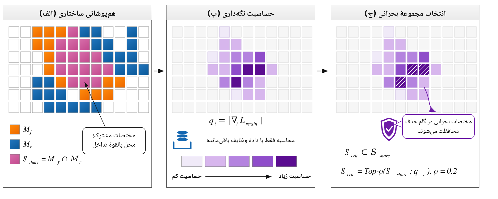
  

  

    
<strong>پارامترهای انحصاری هدف</strong> قابل بازنشانی با خطر کمتر

    
<strong>پارامترهای مشترک</strong> ویرایش آن‌ها می‌تواند به وظایف فعال آسیب بزند

    
PALL اشتراک را ساختاری می‌کند، اما مختصه‌های مشترک را بر اساس حساسیت نگه‌داری تفکیک نمی‌کند.

  

<!--
یادداشت ارائه: تصویر، هم‌پوشانی ماسک زیرشبکه‌ی هدف با اجتماع زیرشبکه‌های فعال را نشان می‌دهد. فرض اصلی این است که آسیب درون ناحیه‌ی مشترک نیز یکنواخت توزیع نشده است.
-->

---

<!-- _class: compact -->

# پرسش‌های پژوهش، یک زنجیره‌ی منطقی می‌سازند

1. آیا حفاظت از مختصه‌های مشترکِ حساس، هم‌زمان سرکوب و نگه‌داری را ممکن می‌کند؟
2. روش مدل‌مشترک تا چه حد به مرجع جداسازی کامل نزدیک می‌شود؟
3. آیا با رشد هم‌پوشانی، سود حفاظت بیشتر می‌شود؟
4. کدام مؤلفه‌ی روش واقعا منشأ بهبود است؟
5. آیا سازوکار مشابه در مسیر کارآمد پارامتری نیز اثرگذار است؟

مشارکت اصلی فقط «یک روش جدید» نیست؛ طراحی روش با تحلیل جفتی، محک هم‌پوشانی، ممیزی مؤلفه‌ای و حسابداری هزینه همراه شده است.

<!--
یادداشت ارائه: این اسلاید نقشه‌ی راه دفاع است. پاسخ‌ها به‌ترتیب: بله؛ نزدیک به CLPU؛ شواهد مثبت اما مشروط؛ رتبه‌بندی حساسیت؛ و برای مسیر آداپتر، خیر.
-->

---

<!-- _class: compact -->

# EPALL: محافظت انتخابی از ناحیه‌ی حساس

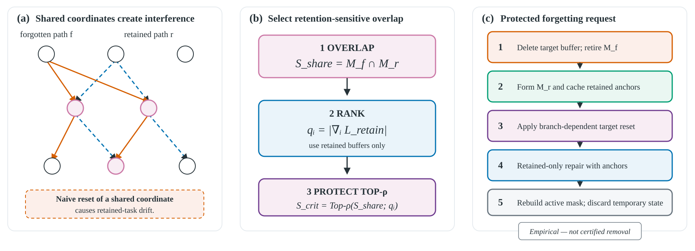

  
محاسبه‌ی اشتراک Mf ∩ Mr

  
←

  
رتبه‌بندی با گرادیان وظایف نگه‌داری‌شده

  
←

  
انتخاب بالای بودجه Top-ρ

  
←

  
ترمیم با لنگر ℓ₂

<!--
یادداشت ارائه: منطق بازنشانی شاخه‌محور PALL حفظ می‌شود. نوآوری EPALL در تعیین مجموعه‌ی حساس و مهار همان مجموعه هنگام ترمیم است.
-->

---

# صورت‌بندی: بودجه‌ی حفاظت را روی حساس‌ترین مختصه‌ها خرج می‌کنیم

  

    <h2>۱. ناحیه‌ی مشترک</h2>
    
Sshare = Mf ∩ Mr

    <h2>۲. حساسیت نگه‌داری</h2>
    
Ii = |∂Lretain / ∂θi|

  

  

    <h2>۳. انتخاب دقیق بودجه</h2>
    
فقط بالاترین سهم ρ از مختصه‌های مشترک محافظت می‌شود.

    <h2>۴. ترمیم مهارشده</h2>
    
لنگر ℓ₂ جابه‌جایی مختصه‌های حساس را محدود می‌کند؛ بقیه‌ی مسیر آزادتر ترمیم می‌شود.

  

ایده‌ی کلیدی، بزرگ‌کردن بودجه نیست؛ <strong>بهبود کیفیت انتخاب با بودجه‌ی ثابت</strong> است.

<!--
یادداشت ارائه: در صورت پرسش درباره‌ی لنگر توضیح دهید که لنگر یک اهرم نگه‌داری است، نه اهرم حذف. بازنشانی ناحیه‌ی انحصاری هدف عامل اصلی سرکوب است.
-->

---

# تحلیل نظری، آگاهانه دامنه‌ی محدودی دارد

  

    <h2>آنچه نشان داده می‌شود</h2>
    <ul>
      <li>یک کران بالای مرتبه‌اول برای افت در زیرفاز مشترک</li>
      <li>کران با افزایش شدت حفاظت p ناافزاینده است</li>
      <li>حساسیت‌ها در ناحیه‌ی هم‌پوشان یکنواخت نیستند</li>
    </ul>
  

  

    <h2>آنچه نتیجه نمی‌شود</h2>
    <ul>
      <li>مقایسه‌ی قطعی افت واقعی دو روش</li>
      <li>تضمین انتها‌به‌انتها برای کل درخواست حذف</li>
      <li>حذف دقیق، گواهی‌شده یا تضمین حریم خصوصی</li>
    </ul>
  

نظریه یک راهنمای طراحی است؛ اعتبار ادعای روش از آزمایش‌های هم‌تراز و کنترل‌های مؤلفه‌ای می‌آید.

<!--
یادداشت ارائه: این مرزبندی مهم است. از مقایسه‌ی دو کران بالا نمی‌توان رابطه‌ای میان دو افت واقعی نتیجه گرفت و کران به نقطه‌ی پایان کل درخواست تعمیم ندارد.
-->

---

<!-- _class: compact -->

# ارزیابی، سه نوع شاهد مکمل دارد

  
<b>11</b>روش مقایسه‌شده

  
<b>8</b>بذر هم‌تراز در Split-CIFAR

  
<b>300</b>اجرای محک موقعیت درخواست

  
<b>3</b>مجموعه‌داده / محک

  

    <h2>محک‌ها</h2>
    <ul>
      <li>Split-CIFAR-10</li>
      <li>Split-CIFAR-100</li>
      <li>TinyImageNet، ۲۰ وظیفه</li>
    </ul>
  

  

    <h2>معیارها</h2>
    <ul>
      <li>دقت نهایی وظایف فعال</li>
      <li>بیشترین افت و فراموشی متوسط</li>
      <li>دقت وظیفه‌ی هدف، زمان و حالت مقیم</li>
    </ul>
  

آزمون‌ها جفتی‌اند و شش مقایسه‌ی اصلی با اصلاح Holm کنترل شده‌اند.

<!--
یادداشت ارائه: رژیم اصلی استاندارد Split-CIFAR با 20 ایپاک به‌ازای هر وظیفه است. دنباله‌ی درخواست درون هر بذر میان روش‌ها مشترک نگه داشته شده است.
-->

---

<!-- _class: compact -->

# هدف حذف سرکوب می‌شود؛ معیار نگه‌داری باید هم‌زمان خوانده شود

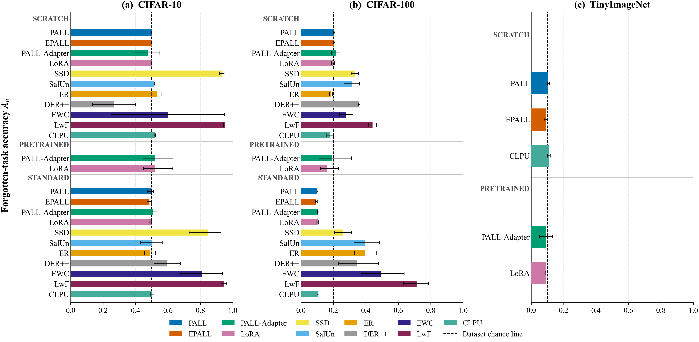

  
<b>0.4863</b>EPALL روی CIFAR-10 · هدف 0.5

  
<b>0.0959</b>EPALL روی CIFAR-100 · هدف 0.1

  
<b>0.8122 / 0.9469</b>EWC / LwF روی CIFAR-10؛ حذف ناموفق

دقت وظیفه‌ی حذف‌شده؛ خط‌چین سطح تصادفی هر محک است.

<!--
یادداشت ارائه: افت صفر به‌تنهایی کافی نیست. EWC و LwF ظاهرا از وظایف دیگر محافظت می‌کنند، اما وظیفه‌ی هدف را حذف نکرده‌اند؛ بنابراین معیارهای حذف و نگه‌داری باید هم‌زمان دیده شوند.
-->

---

<!-- _class: compact -->

# EPALL دقت نگه‌داری را به مرجع جداسازی نزدیک می‌کند

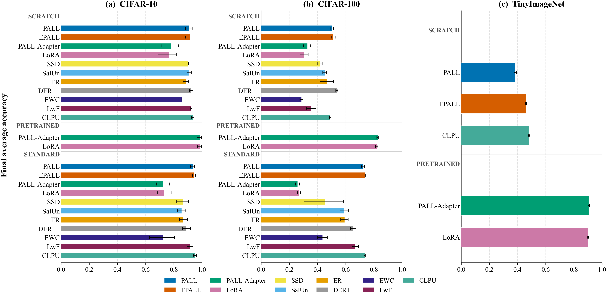

  
<b>0.9346 → 0.9433</b>PALL → EPALL · CIFAR-10

  
<b>0.7223 → 0.7371</b>PALL → EPALL · CIFAR-100

  
<b>0.9500 / 0.7355</b>مرجع CLPU · CIFAR-10 / 100

نزدیکی به CLPU به معنی هم‌ارزی آماری اثبات‌شده نیست؛ آزمون هم‌ارزی اجرا نشده است.

<!--
یادداشت ارائه: روی CIFAR-10 فاصله‌ی EPALL تا CLPU کمتر از یک واحد درصد است. روی CIFAR-100 اعداد بسیار نزدیک‌اند. تعبیر درست «نزدیک‌شدن» است، نه برتری یا هم‌ارزی اثبات‌شده.
-->

---

# حفاظت حساس، بدترین آسیب جانبی را کاهش می‌دهد

  

    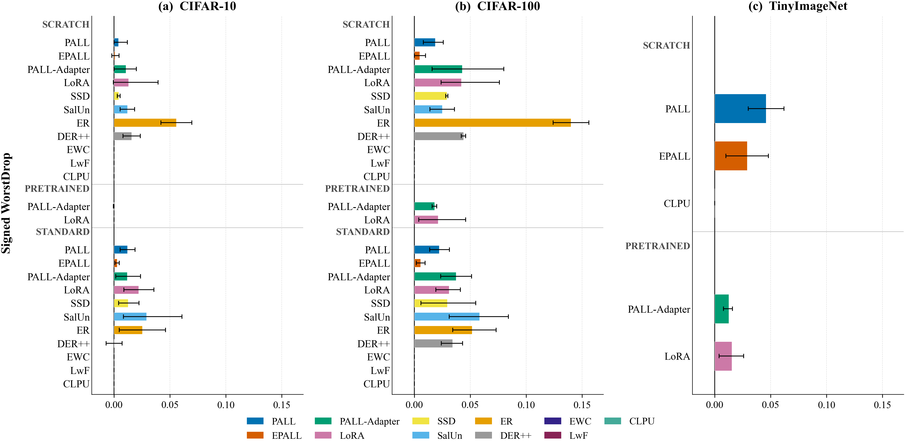
  

  

    
<b>0.0222 → 0.0056</b>CIFAR-100 · کاهش 75٪

    
<b>0.0119 → 0.0027</b>CIFAR-10 · کاهش 77٪

    
پس از اصلاح چندگانگی، نتیجه‌ی بیشترین افت فقط روی CIFAR-100 معنادار می‌ماند.

  

<!--
یادداشت ارائه: کاهش نسبی روی هر دو مجموعه‌داده بزرگ است، اما باید تفاوت قدرت آماری را صریح گفت. بیشترین افت CIFAR-10 پس از Holm از آستانه‌ی 0.05 عبور نمی‌کند.
-->

---

<!-- _class: compact -->

# تحلیل جفتی: چهار نتیجه از شش آزمون باقی می‌ماند

<table>
  <tr><th>مجموعه‌داده</th><th>معیار</th><th>بهبود جفتی</th><th>pHolm</th><th>نتیجه</th></tr>
  <tr class="highlight"><td>CIFAR-100</td><td>دقت نهایی</td><td class="ltr">+0.0147</td><td class="ltr">≤ 0.0469</td><td>معنادار</td></tr>
  <tr class="highlight"><td>CIFAR-100</td><td>فراموشی متوسط</td><td class="ltr">+0.0110</td><td class="ltr">≤ 0.0469</td><td>معنادار</td></tr>
  <tr class="highlight"><td>CIFAR-100</td><td>بیشترین افت</td><td class="ltr">+0.0166</td><td class="ltr">≤ 0.0469</td><td>معنادار</td></tr>
  <tr class="highlight"><td>CIFAR-10</td><td>دقت نهایی</td><td class="ltr">+0.0087</td><td class="ltr">0.0469</td><td>معنادار</td></tr>
  <tr><td>CIFAR-10</td><td>بیشترین افت</td><td class="ltr">+0.0092</td><td class="ltr">0.0625</td><td>نامعنادار</td></tr>
  <tr><td>CIFAR-10</td><td>فراموشی متوسط</td><td class="ltr">−0.0017</td><td class="ltr">—</td><td>مختلط</td></tr>
</table>

قوی‌ترین شاهد، بهبود پایدار روی CIFAR-100 و دقت نهایی هر دو مجموعه‌داده است.

<!--
یادداشت ارائه: آزمون دقیق یک‌طرفه‌ی Wilcoxon برای دقت نهایی هر دو مجموعه‌داده p خام 0.0078 دارد. برای CIFAR-100 هر سه معیار بعد از Holm باقی می‌مانند.
-->

---

# با عقب‌افتادن درخواست، PALL آسیب‌پذیرتر می‌شود

  

    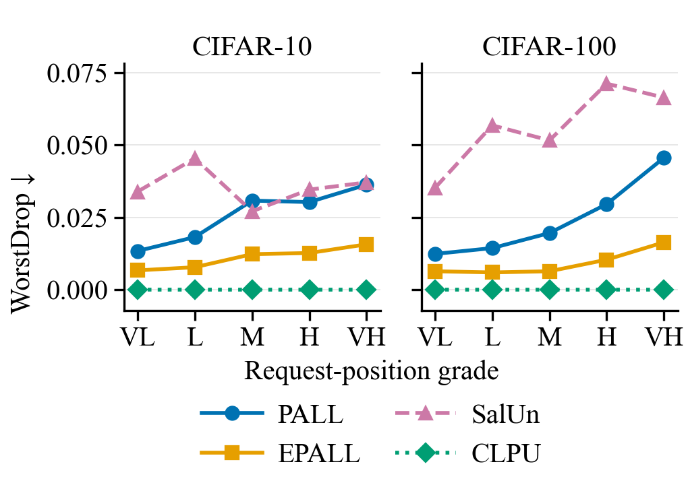
  

  

    
<strong>۳۰۰ اجرای هم‌تراز</strong>

    
PALL روی CIFAR-100: 0.0124 → 0.0456

    
EPALL: 0.0060 … 0.0164

    
محور، موقعیت درخواست است؛ فقط یک شاخص جانشین برای هم‌پوشانی مورد انتظار، نه کنترل علّی آن.

  

<!--
یادداشت ارائه: درجه‌ها تعداد وظایف آموزش‌دیده پس از وظیفه‌ی هدف را کد می‌کنند. با تغییر درجه، هویت و سن وظیفه نیز تغییر می‌کند؛ پس این روند توصیفی است.
-->

---

<!-- _class: compact -->

# جاروب مستقیم‌تر: سود حفاظت با هم‌پوشانی رشد می‌کند

  

    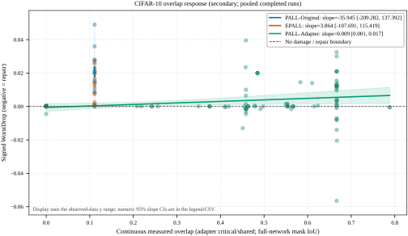
    
CIFAR-10 · ρs=+1.00, p=0.0083

  

  

    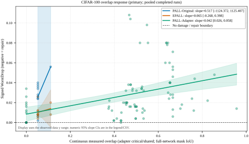
    
CIFAR-100 · ρs=+0.90, p=0.0417

  

با ثابت‌ماندن هویت و موقعیت هدف، هم‌پوشانی بیش از ۱۰ برابر جابه‌جا شد و سود حفاظت رابطه‌ی رتبه‌ای مثبت نشان داد.

اما پراکندگی، ظرفیت را هم تغییر می‌دهد؛ بنابراین اثر علّی خالص هم‌پوشانی هنوز جدا نشده است.

<!--
یادداشت ارائه: پنج سطح پراکندگی، دو روش و پنج بذر در مجموع 100 اجرا می‌سازند. آزمون دقیق بر اساس همه‌ی 120 جایگشت ممکن پنج سطح انجام شده است.
-->

---

# ممیزی مؤلفه‌ای: تنها کیفیت انتخاب تایید می‌شود

  

    <table>
      <tr><th>کنترل</th><th>مشاهده</th><th>تفسیر امن</th></tr>
      <tr class="highlight"><td>بودجه‌ی تصادفی</td><td>در هر دو داده بدتر</td><td>رتبه‌بندی حساسیت مؤثر است</td></tr>
      <tr><td>بدون جریمه‌ی ℓ₂</td><td>جدایی پایدار ندارد</td><td>سهم مستقل لنگر تایید نشد</td></tr>
      <tr><td>رتبه‌بندی بدون اشتراک</td><td>دقیقا برابر بازوی کامل</td><td>فیلتر بالادستی اضافی است</td></tr>
      <tr><td>فقط هم‌پوشانی</td><td>افت کمتر، دقت گاه پایین‌تر</td><td>یک مصالحه؛ نه غالب مطلق</td></tr>
    </table>
  

  

    
<b>+0.0076</b>زیان بیشترین افتِ بودجه‌ی تصادفی روی CIFAR-10

    
<b>+0.0148</b>زیان بیشترین افتِ بودجه‌ی تصادفی روی CIFAR-100

  

ادعای مکانیزمی نهایی باریک‌تر از توصیف روش است: <strong>رتبه‌بندی حساسیت با بودجه‌ی ثابت</strong>.

<!--
یادداشت ارائه: کنترل‌ها نشان می‌دهند روش کار می‌کند، اما همه‌ی اجزای طراحی سهم مستقل قابل‌اندازه‌گیری ندارند. این محدودکردن ادعا نقطه‌ی قوت ممیزی است.
-->

---

<!-- _class: compact -->

# نزدیک‌شدن به جداسازی کامل، حافظه‌ی کمتری می‌خواهد

  

    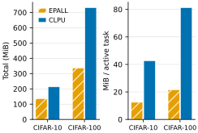
  

  

    
<b>135.85 MiB</b>EPALL · CIFAR-10

    
<b>212.94 MiB</b>CLPU · CIFAR-10

    
<b>336.35 vs 730.78</b>MiB · CIFAR-100

  

EPALL در زمان درخواست کندتر از PALL است؛ مزیت آن در حالت مقیم و رشد کندتر با تعداد وظایف به‌دست می‌آید.

<!--
یادداشت ارائه: حسابداری شامل پارامترهای مقیم، ماسک‌ها، پشتیبان‌های پراکنده و بازپخش است؛ حالت بهینه‌ساز و حافظه‌ی اوج را شامل نمی‌شود.
-->

---

# مسیر PALL-Adapter یک نتیجه‌ی منفیِ مفید است

  

    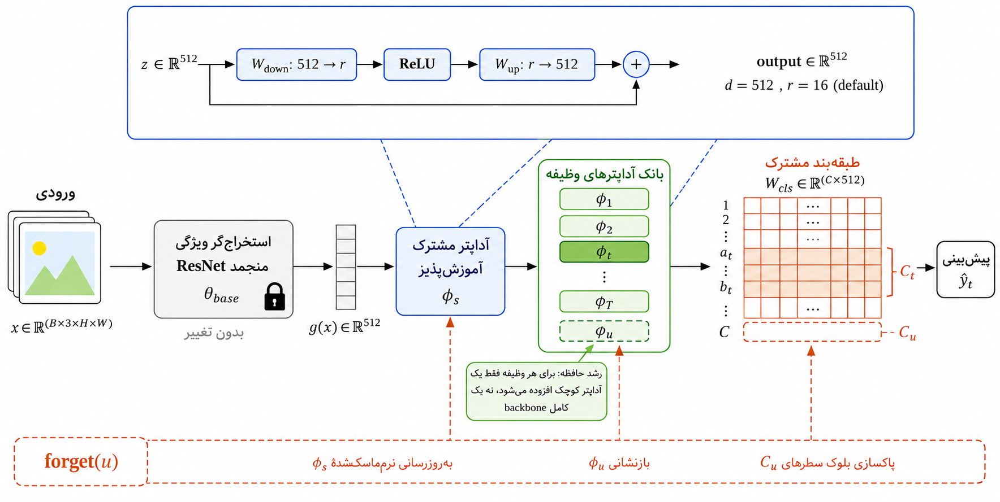
  

  

    <ul>
      <li>بدنه‌ی منجمد + آداپتر مشترک + آداپتر وظیفه</li>
      <li>بازوهای کامل و یکنواخت عملا یکسان‌اند</li>
      <li>ماسک پیوسته واقعا تغییر می‌کند، اما اثر انتها‌به‌انتها ندارد</li>
      <li>سرکوب مشاهده‌شده از <strong>بازنشانی مسیر هدف</strong> می‌آید</li>
    </ul>
  

برای نسخه‌ی بعدی، ماسک مبتنی بر <strong>رتبه</strong> از ماسک مبتنی بر مقدار امیدبخش‌تر است.

<!--
یادداشت ارائه: این مسیر مشارکت دوم ادعاشده نیست. تحلیل نشان می‌دهد انرژی تعارض در دنباله‌ای نازک متمرکز است و ضریب خطی ماسک، مختصه‌ی نوعی را به‌قدر کافی تضعیف نمی‌کند.
-->

---

# سرکوب رفتاری با حذف اثر یکی نیست

  

    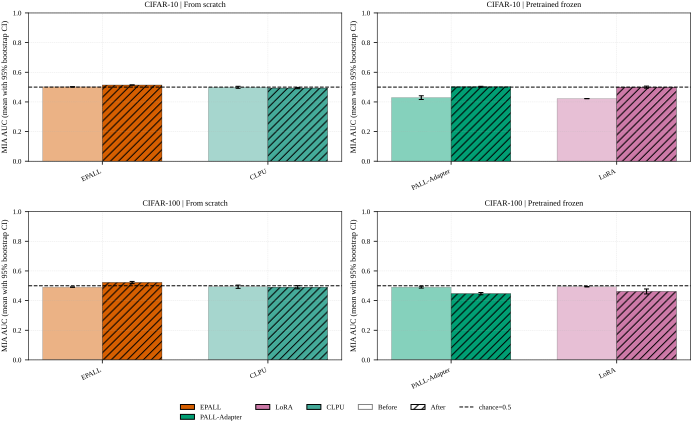
  

  

    
<strong>AUC نزدیک ۰٫۵</strong> یک نتیجه‌ی تهیِ کم‌توان؛ نه شاهد حذف

    
<strong>آماره‌ی تفکیک‌پذیری S</strong> برای EPALL از صفر به میانگین حدود 0.10 و بیشینه‌ی 0.55 می‌رسد

    
فراموشی، نمونه‌های هدف را در این حمله تفکیک‌پذیرتر کرده است.

  

دامنه: حذف در سطح وظیفه و سناریوی Task-Incremental؛ بدون ادعای حذف رکوردی، ذخیره‌سازی، دقیق یا گواهی‌شده.

<!--
یادداشت ارائه: S پارامتر حریم خصوصی تفاضلی نیست. حمله‌های مدل‌سایه و ممیزی صوری انجام نشده‌اند. دقت تصادفی هدف می‌تواند هم‌زمان با الگوی خطای متفاوت و قابل‌تفکیک رخ دهد.
-->

---

<!-- _class: final -->
<!-- _paginate: false -->
<!-- _footer: '' -->

# جمع‌بندی: شناخت ساختار، آسیب فراموشی را مهار می‌کند

<strong>EPALL</strong> با محافظت از مختصه‌های مشترکِ حساس، وظیفه‌ی هدف را سرکوب و دقت وظایف فعال را به مرجع جداسازی نزدیک می‌کند—با حالت مقیم کمتر.

<ul>
  <li>شاهد اصلی: بهبود جفتی دقت و کاهش آسیب، به‌ویژه روی CIFAR-100</li>
  <li>جزء تاییدشده: رتبه‌بندی حساسیت با بودجه‌ی ثابت</li>
  <li>قید اصلی: شواهد هم‌پوشانی مثبت اما غیرعلّی؛ حذف دقیق و تضمین حریم خصوصی اثبات نشده است</li>
  <li>گام بعد: دستکاری ظرفیت‌همتراز هم‌پوشانی، ممیزی رسمی‌تر، و ماسک رتبه‌محور</li>
</ul>

## سپاسگزارم — پرسش‌ها؟

<!--
یادداشت ارائه: پاسخ نهایی به دفاع این است که روش اصلی از هم‌پوشانی به‌عنوان ساختار قابل‌اندازه‌گیری استفاده می‌کند، اما ممیزی‌ها اجازه نمی‌دهند ادعا از شواهد فراتر برود.
-->
